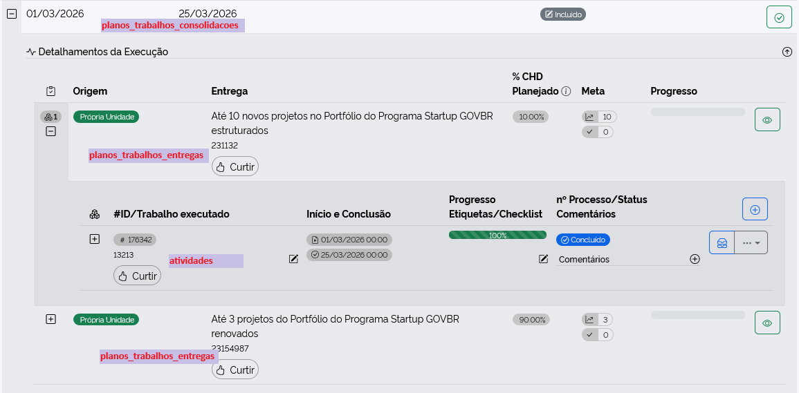
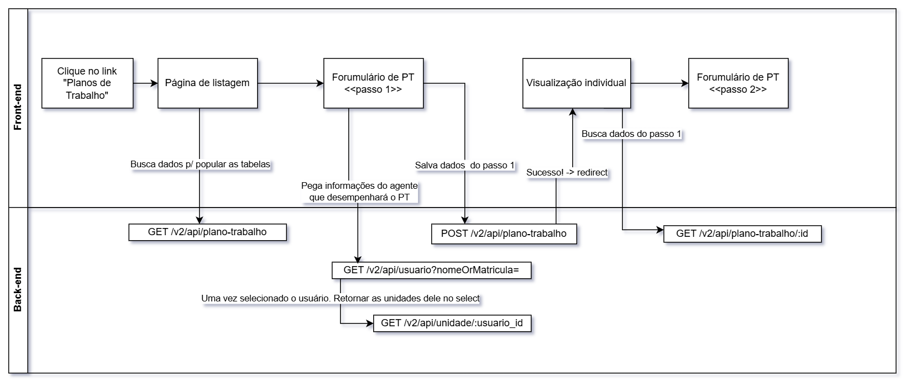

# Planejamento #1683

## Princípios gerais:

- O controller terá apenas lógica da conexão. Ex.: quais campos são aceitos? Que tipo de dado pode vir a partir destes campos?
- A regra de negócio deve estar contida em alto nível no `Service`, ela será o orquestrador das regras de negócio
- Penso em começar a utilizar uma estrutura mais próximo da linguagem de negócios, demonstrando mais claramente a hierarquia. Por exemplo:
	```
	Os nomes são placeholders, mas a ideia é deixar os contextos de negócio mais próximos uns dos outros. Não segregando por funcionalidade dentro do sistema, mas por caso de uso:

	v2/
	L plano-trabalho/
	| L entrega/
	| 	L Controller.php
	| 	L Service.php
	| 	L Validacoes.php
	L CalculadoraPeriodosAvaliativos.php
	L Controller.php
	L Service.php
	L Validacoes.php
	```
- Abolir o uso de `ServiceBase`
- Coverage 100%

## Organização hierárquica (AS-IS)

Os PTs atualmente estão disposto da seguinte forma dentro do BD:

`planos_trabalhos`:
-  `planos_trabalhos_entregas` (1..\*): entregas ligadas ao PE por `plano_entrega_entrega_id`
	<details>
	<summary>Exemplo</summary>

	o PE tem uma entrega _"Acessibilidade da biblioteca"_. Poderia ser criado um PT detalhando que será adicionada uma rampa e piso tátil. `planos_trabalhos_entregas` seria ligado pela entrega do PE `plano_entrega_entrega_id` = `<acessibilidade_uuid>` com a descrição _"contrução da rampa e instalação do piso tátil"_

	</details>
- `planos_trabalhos_consolidacoes` (1..\*): no front antigo são as abas que contêm os REs
	- `atividades` (1..\*): ligada a todas as 3 tabelas `planos_trabalhos*` citadas acima. São os registros do que foi feito e do progresso em si. Atualmente ficam dentro do menu sanduíche das entregas dos REs.

<details>
	<summary>Explicação gráfica</summary>



</details>


## Rotas:

**Legenda**

	^[campo] = dependência de um campo principal. Se o campo principal não for passado, ignora-se o campo dependente. Consequentemente, suas validações também
	§ = Indisponível para perfil participante ou hierarquicamente inferior
	* = Obrigatório

_Não necessariamente o tratamento dos campos `§` será feito no controller_

---

### Plano de trabalho

#### `GET /api/v2/plano-trabalho` `3.*`

Body:
- include_arquivados`§`(bool) `RN01,04,06,07`
- include_from_unidades_subordinadas`§`(bool) `RN01-03`
- unidade_ids`§^[include_from_unidades_subordinadas]`(array) `RN01-03,12`
	- unidade atual do usuário que está criando o PT. Se for possível identificá-la via back-end, remover esse campo
- only_vigentes(bool) `RN01,06,07`
- only_meus_planos(bool) `RN01,05`

#### `GET /api/v2/plano-trabalho/:id` `4.7`

Não há nada que deixe explícito no ticket a partir da qual o PT é consequentemente consultável individualmente. No entanto, [baseado no print](screenshot-get-pt-id.png), esterei presumindo que já a partir do passo 1, contemplado no end-point `POST /api/v2/plano-trabalho`, o PT será salvo, tendo uma uuid que poderá ser passada como parâmetro deste end-pont.

Quanto ao status, poderia ser feito um processamento no back-end para verificar a existência de entregas e consolidações. E, caso ainda esteja na fase inicial, sem nada de consolidação/RE, retorna o status como rascunho, ou um `is_rascunho = true`

O fluxo base que estou visualizando (happy-path) para chegar até aqui da primeira vez é o seguinte:

<details>
<summary>Diagrama Get by ID</summary>


</details>

#### `POST /api/v2/plano-trabalho` `4.2-4.4`

Body:
- usuario_id`*`(uuid) `RN18`
- unidade_id`*`(uuid) `RN19`
- programa_id`*`(uuid) `RN20`
- data_inicio`*`(date) `RN21,22,23`
- data_fim`*`(date) `RN21,22,23`
- modalidade`*`(?) `RN24`
- justificativa`*^[modalidade]`(string(500)) `RN24`

#### `PATCH /api/v2/plano-trabalho/:id/status` `4.10, 4.12, 4.22, 4.23`

Body:
- status`*`(string) - o novo status desejado (ex.: `CANCELADO`, `SUSPENSO`, `ATIVO`)

O endpoint recebe o status desejado e delega para o método correspondente à transição. O service status apenas recebe o PT, o status desejado e chama o método do status. Cada transição segue o fluxo:

1. **Transição válida?** - verifica se o status atual permite ir para o status solicitado (máquina de estados). Algo do tipo:

```php
class PlanoTrabalhoStatusMachine
{
	# talvez possamos deixar isso daqui dentro do model, e chamar dentro de uma classe genérica Status::canTransition($entity, 'NOVO_STATUS')
	# dentro, definir $from = $entity->status
	# e fazer a comparação com $entity::TRANSITIONS[$from]
    const TRANSITIONS = [ 
        'INCLUIDO'  => ['ATIVO'],
        'ATIVO'     => ['SUSPENSO', 'CANCELADO'],
        'SUSPENSO'  => ['ATIVO', 'CANCELADO'],
        'CANCELADO' => [],
    ];

    public static function canTransition(string $from, string $to): bool
    {
        return in_array($to, self::TRANSITIONS[$from] ?? []);
    }
}
```

2. **Guards** - validações/precondições específicas da transição (permissão do usuário, estados e demais regras de negócio associadas às dependências)
3. **Ações** - operações no banco dentro de uma transaction (ex.: alterar status, aplicar `deleted_at` em `planos_trabalhos_consolidacoes`)

#### `DELETE /api/v2/plano-trabalho/:id` `4.11`

### Entregas do Plano de Trabalho

#### `POST /api/v2/plano-trabalho/:id/entrega` `4.5`

Body:
- entregas(array)`RN26,29-32`
	- array:
		- unidade_id(uuid)
		- plano_entrega_entrega_id(uuid)`RN31,32`
		- forca_trabalho(decimal)`RN29,30`
		- descricao(string(1000))	
- justificativa`^[SOMA(forca_trabalho!=100.0)]`(string)`RN29,30` _não encontrei nenhuma coluna que seja dedicada à explicação de divergências da %CHD, (o mais próximo seria `texto_complementar_plano`). Será que valeria a pena criar um `justificativa_carga_horaria_disponivel`?_

#### `PUT /api/v2/plano-trabalho/:id/entrega/:entrega_id` `RN27`

Body:
- entrega_id`*`(uuid) - uuid do `planos_trabalhos_entregas`
- unidade_id(uuid)
- plano_entrega_entrega_id(uuid)`RN31,32`
- forca_trabalho(decimal)`RN29,30`
- descricao(string(1000))

#### `DELETE /api/v2/plano-trabalho/:id/entrega/:entrega_id`


## Componentes:

1 - Breadcrumbs
- Seguir o padrão do gov.br
	- Breadcrumbs dentro de um <nav> com aria-label
	- Partir da página inicial, representada com o ícone de uma casa, mas com um texto oculto explicitando que é a Página inicial
	- Ao longo da navegação do site ir adicionando à direita o "rastro" do usuário
	- As páginas anteriores devem ter links apontando para elas mas a página atual não, e ficará em destaque com negrito
	
	Ex.:

	[🏠(aria: "Página inicial")](/home) > [Página avó](/home/avo) > [Página pai](/home/avo/pai) > **Página atual**

2 - Toggle

Ex.:
```
+-------------------+  +-------------------+
|Título Centralizado|  |Título Centralizado|
|      (( )0)		|  |  	  (1( ))	   |
+-------------------+  +-------------------+
```