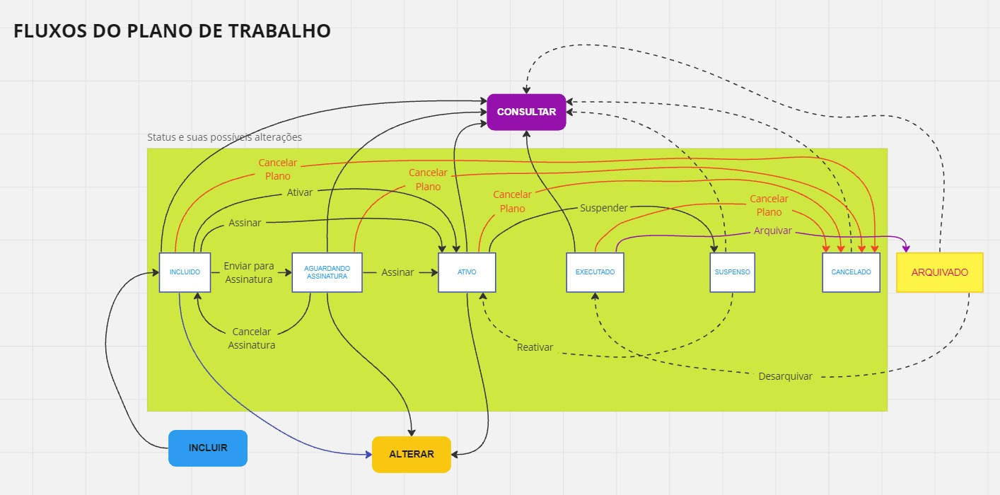

# MÓDULO: PLANO DE TRABALHO

## CAPACIDADES  

~~~text
    MOD_PTR - Permite acessar item menu Plano de Trabalho
    MOD_PTR_EDT - Permite editar planos de trabalho
    MOD_PTR_INCL - Permite incluir planos de trabalho
    MOD_PTR_EDT_ATV - Permite editar planos de trabalho ativos
    MOD_PTR_CNC - Permite cancelar planos de trabalho
    MOD_PTR_USERS_INCL - Permite incluir planos de trabalho para usuários que não estão lotados nas áreas de trabalho do usuário logado
    MOD_PTR_INCL_SEM_LOT - Permite incluir planos de trabalho para usuários que não estão lotados na unidade executora
    MOD_PTR_INTSC_DATA - Permite incluir plano de trabalho que possua período conflitante com outro já existente na mesma unidade/servidor
~~~

## BANCO DE DADOS

~~~text
Tabela: planos_trabalhos

Campos obrigatórios:
    carga_horaria
    tempo_total
    tempo_proporcional
    numero
    data_inicio
    data_fim
    forma_contagem_carga_horaria
    status
    programa_id
    usuario_id
    unidade_id
    tipo_modalidade_id
    criacao_usuario_id+
~~~

## REGRAS DE NEGÓCIO

- (RN_PTR_A) Quando um Plano de Trabalho é criado adquire automaticamente o status INCLUIDO;
- (RN_PTR_B) O Plano de Trabalho pode ser incluído pelo próprio servidor, se ele for "participante do programa", habilitado, ou pelo gestor da Unidade Executora.
- (RN_PTR_C) Quando o gestor da Unidade Executora criar o primeiro Plano de Trabalho para um servidor, este tornar-se-á automaticamente um participante habilitado;
- (RN_PTR_D) O Plano de Trabalho só vai para o status ATIVO quando atender os critérios de assinatura, que estarão definidos no TCR com base nas configurações do Programa;
- (RN_PTR_E) O Plano de Trabalho precisará ser repactuado quando alguma de suas entregas estiver vinculada a uma entrega de plano de entrega cancelada;
- (RN_PTR_F) Os planos de trabalho dos participantes contribuem direta ou indiretamente para o plano de entregas da unidade. Assim, um Plano de Trabalho será composto por atividades relacionadas ou não às entregas do plano de entregas da unidade;
- (RN_PTR_G) Na criação/alteração de um Plano de Trabalho só podem ser criadas/alteradas entregas se vinculadas a entregas de planos de entregas não canceladas;
- (RN_PTR_H) Segundo as configurações do Programa de Gestão, no TCR poderá ser exigida a assinatura dos seguintes atores: participante, gestor da Unidade Executora, gestor da Unidade de Lotação e/ou gestor da Unidade Instituidora; entretanto, ainda segundo o Programa de Gestão, o TCR pode ser dispensável e, nesse caso, obviamente nenhuma assinatura será exigida;
- (RN_PTR_I) Quando a Unidade Executora não for a unidade de lotação do servidor, seu gestor imediato deve ter acesso ao seu Plano de Trabalho (e à sua execução);
- (RN_PTR_J) Quando todas as consolidações de um Plano de Trabalho forem avaliadas, informar que este está também avaliado (não é um status);
- (RN_PTR_K) Quando um Plano de Trabalho é cancelado, todas as suas entregas são canceladas;
- (RN_PTR_L) Um Plano de Trabalho adquire o status 'CONCLUIDO' quando a sua última consolidação for avaliada;
- (RN_PTR_Y) Para incluir um Plano de Trabalho para um participante, é necessário que este esteja lotado em uma das áreas de trabalho do usuário logado, a menos que este possua a capacidade MOD_PTR_USERS_INCL;
- (RN_PTR_Z) Na inclusão de um Plano de Trabalho, é necessário que o participante esteja lotado na Unidade Executora, a menos que o usuário logado possua a capacidade MOD_PTR_INCL_SEM_LOT;
- (RN_PTR_AA) Um Plano de Trabalho não pode ser incluído se apresentar período conflitante com outro Plano de Trabalho já existente para a mesma unidade/servidor, a menos que o usuário logado possua a capacidade MOD_PTR_INTSC_DATA;
- (RN_PTR_AB) Um Plano de Trabalho não pode ser excluído;
- (RN_PTR_AC) Quando um participante tiver um plano de trabalho criado, ele se tornará automaticamente um COLABORADOR da sua unidade executora;
- (RN_PTR_AD) Após criado um plano de trabalho, a sua unidade e programa não podem mais ser alterados.

## FLUXOS (STATUS & AÇÕES)

~~~text
status possíveis = ['INCLUIDO', 'AGUARDANDO_ASSINATURA', 'ATIVO', 'CONCLUIDO', 'SUSPENSO', 'CANCELADO']
-----------------------------------------------------------------------------------------------------------------------------------
obrigatoriedade     | inclusão realizada  |  status     |  evento que                |  status      |  evento que       |  status
da assinatura       | pelo                |  inicial    |  faz avançar               |  seguinte    |  faz avançar      |  seguinte
--------------------+--------------------------------------------------------------------------------------------------------------
    participante    | participante        |  INCLUIDO   |  participante              |  AGUARDANDO  |  gestores assinam |  ATIVO*
    gestor TCR      |                     |             |  assina o TCR              |  ASSINATURA  |  o TCR            |  
    gestor imediato +--------------------------------------------------------------------------------------------------------------
    gestor entidade | gestor              |  INCLUIDO   |  gestor assina             |  AGUARDANDO  |  particip/gestor  |  ATIVO
                    |                     |             |  o TCR                     |  ASSINATURA  |  assinam o TCR    |  
--------------------+--------------------------------------------------------------------------------------------------------------
                    | participante        |  INCLUIDO   |  gestor/participante       |  ATIVO       |                   |  
                    |                     |             |  ativa o plano             |              |                   |  
    ninguém         +--------------------------------------------------------------------------------------------------------------
                    | gestor              |  INCLUIDO   |  gestor/participante       |  ATIVO       |                   |  
                    |                     |             |  ativa o plano             |              |                   |  
--------------------+--------------------------------------------------------------------------------------------------------------
                    | participante        |  INCLUIDO   |  participante              |              |                   |
                    |                     |             |  envia para                |  AGUARDANDO  |  gestores assinam |  ATIVO 
                    |                     |             |  assinatura do TCR         |  ASSINATURA  |  o TCR            |  
    gestor(es)      +--------------------------------------------------------------------------------------------------------------
                    | gestor              |  INCLUIDO   |  gestor ativa (e assina)   |  ATIVO       |                   |  
                    |                     |             |  o plano                   |              |                   |  
--------------------+--------------------------------------------------------------------------------------------------------------
                    | participante        |  INCLUIDO   |  participante              |  ATIVO       |                   |  
                    |                     |             |  ativa (e assina) o plano  |              |                   |  
    participante    +--------------------------------------------------------------------------------------------------------------
                    | gestor              |  INCLUIDO   |  gestor envia              |              |                   |  
                    |                     |             |  para                      |  AGUARDANDO  |  participante     |  ATIVO
                    |                     |             |  assinatura do TCR         |  ASSINATURA  |  assina o TCR     |  
--------------------+--------------------------------------------------------------------------------------------------------------
~~~

Ação: ALTERAR -> não muda o status do plano se ele estiver com o status 'INCLUIDO' ou 'AGUARDANDO_ASSINATURA', mas retorna ao status 'AGUARDANDO_ASSINATURA' se ele estiver no status 'ATIVO';

- (RN_PTR_M) Condições para que um Plano de Trabalho possa ser alterado:
  - o usuário logado precisa possuir a capacidade "MOD_PTR_EDT", o Plano de Trabalho precisa ser válido (ou seja, nem deletado, nem arquivado, nem estar no status CANCELADO), e:
    - estando com o status 'INCLUIDO', o usuário logado precisa ser o participante do plano ou o gestor da Unidade Executora;
***************    - estando com o status 'AGUARDANDO_ASSINATURA', o usuário logado precisa ser um dos que já assinaram o TCR e todas as assinaturas tornam-se sem efeito;
    - estando com o status 'ATIVO', o usuário precisa ser gestor da Unidade Executora e possuir a capacidade MOD_PTR_EDT_ATV.
  - Como a alteração pode ser no participante, e nas datas de início e fim do plano, faz-se necessário revalidar as respectivas regras da inserção do plano.
***************  - Após alterado, o Plano de Trabalho precisa ser repactuado (novo TCR), e o plano retorna ao status 'AGUARDANDO_ASSINATURA';

*/*Ação: ARQUIVAR -> não muda o status do plano ('CONCLUIDO');

- (RN_PTR_N) Condições para que um Plano de Trabalho possa ser arquivado:
  - o plano precisa estar com o status CONCLUIDO ou CANCELADO, não ter sido arquivado, e:
  - o usuário logado precisa ser o participante ou o gestor da Unidade Executora;

*/*Ação: ATIVAR -> o plano vai para o status 'ATIVO';

- (RN_PTR_P) Condições para que um Plano de Trabalho possa ser ativado:
  - o plano precisa estar no status 'INCLUIDO', e
    - o usuário logado precisa ser o participante do plano ou gestor da Unidade Executora, e
    - nenhuma assinatura no TCR ser exigida pelo programa, e
    - o plano de trabalho precisa ter ao menos uma entrega;

Ação: CANCELAR ASSINATURA -> o plano permanece no status 'AGUARDANDO_ASSINATURA' ou retorna ao status 'INCLUIDO';

- (RN_PTR_Q) Condições para que um Plano de Trabalho possa ter uma assinatura cancelada:
  - o plano precisa estar no status 'AGUARDANDO_ASSINATURA'; e
    - o usuário logado precisa já ter assinado o TCR;
  - Após o cancelamento da assinatura do usuário logado, se existir assinatura(s) de outro(s) usuário(s), o plano permanece no status 'AGUARDANDO_ASSINATURA'. Caso contrário, retrocessará para o status 'INCLUIDO';

*/*Ação: CANCELAR PLANO -> o plano adquire o status de 'CANCELADO';

- (RN_PTR_R) Condições para que um Plano de Trabalho possa ser cancelado:
  - o usuário logado precisa possuir a capacidade "MOD_PTR_CNC", e
    - o plano precisa estar em um dos seguintes status: INCLUIDO, AGUARDANDO_ASSINATURA, ATIVO ou CONCLUIDO; e
    - o usuário logado precisa ser gestor da Unidade Executora;

*/*Ação: CONSULTAR -> não muda o status do plano;

- (RN_PTR_S) Condições para que um Plano de Trabalho possa ser consultado:
  - todos os participantes podem visualizar todos os planos de trabalho, desde que possuam a capacidade "MOD_PTR";

*/*Ação: DESARQUIVAR -> o plano retorna ao status que estava quando foi arquivado ('CONCLUIDO');

- (RN_PTR_T) Condições para que um Plano de Trabalho possa ser desarquivado:
  - o plano precisa estar arquivado, e:
    - o usuário logado precisa ser o participante ou gestor da Unidade Executora;

Ação: ENVIAR PARA ASSINATURA -> o plano vai para o status 'AGUARDANDO_ASSINATURA';

- (RN_PTR_U) Condições para que um Plano de Trabalho possa ser enviado para assinatura:
  - o plano precisa estar com o status INCLUIDO; e
    - o usuário logado precisa ser o participante do plano ou gestor da sua Unidade Executora; e
    - se a assinatura do usuário logado for exigida, ele já deve ter assinado o TCR; e
    - devem existir assinaturas exigíveis ainda pendentes; e
    - o plano precisa possuir ao menos uma entrega.

*/*Ação: INSERIR/INCLUIR -> o plano adquire o status de 'INCLUIDO';

- (RN_PTR_V) Condições para que um Plano de Trabalho possa ser criado:
  - o usuário logado precisa possuir a capacidade "MOD_PTR_INCL", e:
    - o usuário logado precisa ser um participante do PGD, habilitado, ou ser gestor da Unidade Executora do plano; (RN_PTR_B); e
***** REDISCUTIR ESSA REGRA *****- o participante do plano precisa estar lotado em uma das áreas de trabalho do usuário logado, ou este deve possuir a capacidade MOD_PTR_USERS_INCL (RN_PTR_Y); e**
****** REDISCUTIR ESSA REGRA **********- o participante do plano precisa estar lotado na Unidade Executora, ou o usuário logado possuir a capacidade MOD_PTR_INCL_SEM_LOT (RN_PTR_Z); e**
    - o novo Plano de Trabalho não pode apresentar período conflitante com outro plano já existente para a mesma Unidade Executora e mesmo participante, ou o usuário logado possuir a capacidade MOD_PTR_INTSC_DATA (RN_PTR_AA)

*/*Ação: REATIVAR -> o plano adquire novamente o status de 'ATIVO';

- (RN_PTR_W) Condições para que um Plano de Trabalho possa ser reativado:
  - o plano precisa estar com o status SUSPENSO, e
    - o usuário logado precisa ser gestor da Unidade Executora;

*/*Ação: SUSPENDER -> o plano adquire o status de 'SUSPENSO';

- (RN_PTR_X) Condições para que um Plano de Trabalho possa ser suspenso:
  - o plano precisa estar com o status ATIVO, e
    - o usuário logado precisa ser gestor da Unidade Executora;

## BOTÕES

- 'Alterar'. Condições para ser exibido: vide RN_PTR_M;
- 'Arquivar'. Condições para ser exibido: vide RN_PTR_N;
- 'Assinar'. Condições para ser exibido: vide RN_PTR_O;
- 'Ativar'. Condições para ser exibido: vide RN_PTR_P;
- 'Cancelar assinatura'. Condições para ser exibido: vide RN_PTR_Q;
- 'Cancelar plano'. Condições para ser exibido: vide RN_PTR_R;
- 'Consultar'. Condições para ser exibido: vide RN_PTR_S;
- 'Desarquivar'. Condições para ser exibido: vide RN_PTR_T;
- 'Enviar para assinatura'. Condições para ser exibido: vide RN_PTR_U;
- 'Incluir'. Condições para ser exibido: vide RN_PTR_V;
- 'Reativar'. Condições para ser exibido: vide RN_PTR_W;
- 'Suspender'. Condições para ser exibido: vide RN_PTR_X;

## REGRAS DE INTERFACE

~~~text
- Estando no status "INCLUIDO"
  - botões-padrão:
    - 'Assinar'. Condições para ser exibido: vide RN_PTR_O;                  (quando for exigida apenas a assinatura do usuário logado no TCR)
    - 'Ativar'. Condições para ser exibido: vide RN_PTR_P;                   (quando não for exigida nenhuma assinatura no TCR)
    - 'Enviar para Assinatura'. Condições para ser exibido: vide RN_PTR_U;
    - 'Consultar'. Condições para ser exibido: vide RN_PTR_S;
  - botões opcionais:
    - 'Alterar'. Condições para ser exibido: vide RN_PTR_M;
    - 'Assinar'. Condições para ser exibido: vide RN_PTR_O;
    - 'Ativar'. Condições para ser exibido: vide RN_PTR_P;
    - 'Cancelar plano'. Condições para ser exibido: vide RN_PTR_R;
    - 'Consultar'. Condições para ser exibido: vide RN_PTR_S;
    - 'Enviar para assinatura'. Condições para ser exibido: vide RN_PTR_U;

- Estando no status "AGUARDANDO_ASSINATURA"
  - botões-padrão:
    - 'Assinar'. Condições para ser exibido: vide RN_PTR_O;
    - 'Consultar'. Condições para ser exibido: vide RN_PTR_S;
  - botões opcionais:
    - 'Alterar'. Condições para ser exibido: vide RN_PTR_M;
    - 'Assinar'. Condições para ser exibido: vide RN_PTR_O;
    - 'Cancelar assinatura'. Condições para ser exibido: vide RN_PTR_Q;
    - 'Cancelar plano'. Condições para ser exibido: vide RN_PTR_R;
    - 'Consultar'. Condições para ser exibido: vide RN_PTR_S;

- Estando no status "ATIVO"
  - botões-padrão:
    - 'Consultar'. Condições para ser exibido: vide RN_PTR_S;
  - botões opcionais:
    - 'Alterar'. Condições para ser exibido: vide RN_PTR_M;
    - 'Cancelar plano'. Condições para ser exibido: vide RN_PTR_R;
    - 'Consultar'. Condições para ser exibido: vide RN_PTR_S;
    - 'Suspender'. Condições para ser exibido: vide RN_PTR_X;

- Estando no status "CONCLUIDO"
  - botões-padrão:
    - 'Arquivar'. Condições para ser exibido: vide RN_PTR_N;
    - 'Consultar'. Condições para ser exibido: vide RN_PTR_S;
  - botões opcionais:
    - 'Arquivar'. Condições para ser exibido: vide RN_PTR_N;
    - 'Cancelar plano'. Condições para ser exibido: vide RN_PTR_R;
    - 'Consultar'. Condições para ser exibido: vide RN_PTR_S;

- Estando no status "SUSPENSO"
  - botões-padrão:
    - 'Consultar'. Condições para ser exibido: vide RN_PTR_S;
  - botões opcionais:
    - 'Consultar'. Condições para ser exibido: vide RN_PTR_S;
    - 'Reativar'. Condições para ser exibido: vide RN_PTR_W;

- Estando no status "CANCELADO"
  - botões-padrão:
    - 'Consultar'. Condições para ser exibido: vide RN_PTR_S;
  - botões opcionais:
    - 'Consultar'. Condições para ser exibido: vide RN_PTR_S;

- Estando na condição de "ARQUIVADO"
  - botões-padrão:
    - 'Consultar'. Condições para ser exibido: vide RN_PTR_S;
  - botões opcionais:
    - 'Consultar'. Condições para ser exibido: vide RN_PTR_S;
    - 'Desarquivar'. Condições para ser exibido: vide RN_PTR_T;
~~~

- No formulário de inclusão/edição de um Plano de Trabalho:
  - (RI_PTR_A) se o usuário logado não for gestor da Unidade Executora, o inputSearch de usuário já vem preenchido com o seu nome e permanece bloqueado;
  - (RI_PTR_B) os input-search de unidade, programa e usuario devem ficar desabilitados nas edições e habilitado apenas nas inclusões;

## REGRAS DE NEGÓCIO APLICADAS ÀS ENTREGAS DO PLANO DE TRABALHO

(RN_PTR_ENT_) A distribuição dos percentuais de carga horária do participante deve atender a três categorias de atividades: aquelas vinculadas a entregas do Plano de Trabalho da unidade, aquelas não vinculadas a entregas mas que são do interesse da sua unidade organizacional, e por fim aquelas vinculadas a entregas de um Plano de Trabalho de outra unidade organizacional.
(RN_PTR_ENT_) As entregas de um Plano de Trabalho só podem ser vinculadas a entregas de Planos de Entregas homologados (vide RN_PTR_G)
(RN_PTR_ENT_) Toda atividade deve gerar uma entrega/resultado;

## QUESTÕES PENDENTES

. a data final deve ser maior que a data inicial (não pode nem ser igual)
. incluir na documentação do programa de gestão: quando um usuário for habilitado no PGD manualmente, deve ser automaticamente atribuída a ele a capacidade MOD_PTR_INCL

## MÉTODO DESLOCADO PARA O DOCUMENTOSCONTROLLER/SERVICE

(RN_PTR_O) Ação: ASSINAR

- Enquanto faltar assinatura no TCR, o plano vai para o (ou permanece no) status de 'AGUARDANDO_ASSINATURA'. Quando o último assinar o TCR, o plano vai para o status 'ATIVO';
- Condições para que um Plano de Trabalho possa ser assinado:
  - o plano precisa possuir ao menos uma entrega, e:
  - o plano precisa estar com o status INCLUIDO, e:
    - o usuário logado precisa ser o participante do plano ou o gestor da sua Unidade Executora, e
    - a assinatura do usuário logado precisa ser uma das exigidas pelo Programa de Gestão, e ele não ter ainda assinado;
  - ou o plano precisa estar com o status AGUARDANDO_ASSINATURA, e:
    - a assinatura do usuário logado precisa ser uma das exigidas pelo Programa de Gestão, e ele não ter ainda assinado;
